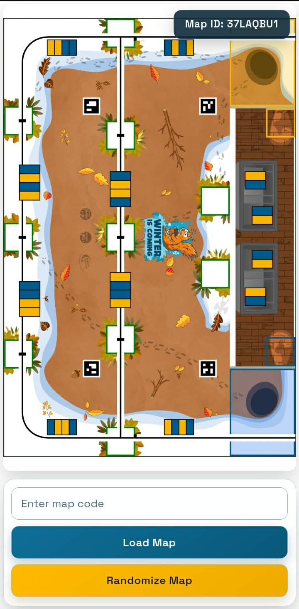

# Eurobot Map Randomizer

	

This is a simple web app used to randomize game elements for the Eurobot 2026 qualification in Tunisia hosted in INSAT.

The app allows you to:
- quickly randomize the map configuration,
- display a shareable map code,
- load a map from an existing code,
- run on desktop and mobile devices (PWA).

## Screenshot

	

## Quick Start
Open the web app [here](https://ayoub-ben-yedder.github.io/EurobotMapRandomizer/)

Click **Install** to add it to your home screen (optional)